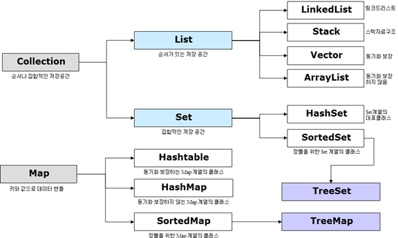
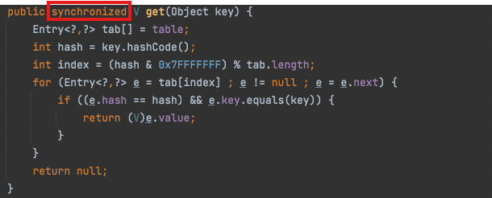

# Q1. Collection과 Collections 차이

## 답변

`Collection`은 **Collection Framework 의 최상위 인터페이스**이고,  

`Collections`는 **컬렉션을 다루는 유틸리티 static 메서드 모음 클래스**입니다.  

👉 Collection이 데이터를 담는 **그릇** 자체를 의미한다면,  
👉 Collections는 그 **그릇들을 다루고 조작하는 도구** !!

---

## **Collection**

- **소속**: `java.util` 패키지  
- **정의**: `List`, `Set` 등의 컬렉션 자료구조들을 위한 공통 기능을 정의하는 최상위 **인터페이스**  

### 역할
컬렉션 프레임워크에서 `List`나 `Set`과 같은 구체적인 자료구조들이 가져야 할 기본 기능 제공  
- `add()`, `remove()`, `size()`, `iterator()` 등

---

## **Collections**

- **소속**: `java.util` 패키지  
- **정의**: `static` 메소드를 통해 다양한 컬렉션 작업에 유용한 기능 제공  

### 역할
- Collection 인터페이스 구현 객체(예: `ArrayList`)를 정렬, 검색, 변환 등 조작 가능  
- 대표 메서드:
  - `sort()`, `reverse()`, `max()`, `min()`

👉 예시  
- `List<String>` 은 Collection 인터페이스를 상속받아 구현된 자료구조  
- `Collections.sort(list)` → List 객체 정렬 (Collections 클래스 기능)

---

### **Collection Framework란 ?**

자료구조를 바탕으로 객체·데이터들을 효율적으로 관리할 수 있는 **라이브러리**

---

### **컬렉션 프레임워크 주요 인터페이스**

1. **List 인터페이스**  
2. **Set 인터페이스**  
3. **Map 인터페이스** (❗ Collection에는 미포함)



📌 특징
- 객체(Object) 타입만 저장 가능  
- 원시 타입(primitive)은 저장 불가 → **Boxing** 필요 (자동 박싱 `Auto Boxing` 지원)  
  - `int → Integer`  
  - `double → Double`  
  - `char → Character`  
  - `boolean → Boolean`
 
```java
List<Integer> list = new ArrayList<>();
list.add(10);          // 실제로는 int 10이 자동으로 Integer(객체)로 변환됨
list.add(new Integer(20)); // 명시적으로 박싱(Boxing)
```
- 객체를 저장한다 = 주소값을 저장한다 → 따라서 **null 저장 가능**  

---

> 📌 **Primitive 타입 (원시타입)**  
> → `byte`, `short`, `int`, `long`, `float`, `double`, `char`, `boolean` (총 8개)  
> → 객체가 아닌 단순 값(value)만 저장하는 기본 자료형

---

# Q2. HashTable vs HashMap 차이

## 답변

**HashMap**은 **비동기화**되어 성능이 빠르고 **null을 허용**하지만, 

**HashTable**은 **동기화**되어 멀티스레드 환경에서 안전하며 **null을 허용하지 않습니다**.

---

| 구분 | **Hashtable** | **HashMap** |
| --- | --- | --- |
| **패키지** | `java.util` | `java.util` |
| **등장 시기** | JDK 1.0 | JDK 1.2 |
| **동기화** | ✅ 동기화 지원 | ❌ 비동기화 |
| **Thread-safe** | O (멀티스레드 안전) | X (안전하지 않음) |
| **성능** | 동기화로 상대적으로 느림 | 단일 스레드 환경에서 빠름 |
| **Null 허용 여부** | ❌ 키/값 모두 불가 | ✅ 키 1개, 값 여러 개 허용 |
| **Iterator** | `Enumeration` (구식) | `Iterator` (fail-fast 지원) |
| **사용 환경** | 멀티스레드, 안전성 우선 | 싱글스레드, 성능 우선 |
| **대체 여부** | 레거시 유지용 | 보통 `HashMap` + `Collections.synchronizedMap()` 또는 `ConcurrentHashMap` 사용 |

- HashTable <br>
  

- HashMap<br>
  

---

> 📌 **Hash**  
> - **Hash**: 해시 함수로 생성된 고정 길이의 비트열  
> - **특징**: 단방향 암호화 (복호화 불가)  
> - **Hashing**: Key → Hash value 로 변환하는 과정  
> - **Hash 충돌 (Collision)**: 변환 값이 중복되는 현상  
>   - 해결책: **체이닝(Chaining)**, **개방 주소법(Open Addressing)**

